**MIS Control Module** 

1. **Cluster Master File**

   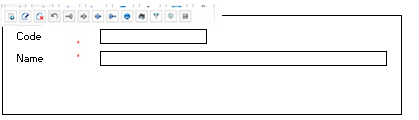

1. **Cost Center  Master File**

   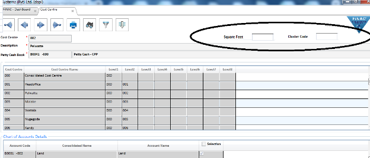

Square Feet  -New Field to enter Show room square feet

Cluster Code –New Field (select from Cluster Master File)

1. **Grade Master File   ( For Janitors/Security)**

   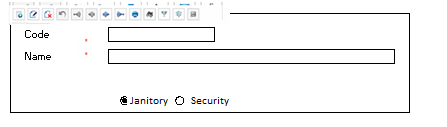

Eg:  Janitors   -Supervisor, Female Janitor, Male Janitor

`       `Security    -OIC,SSO,SSSO,JSO,LSO

1. **MIS Account Mapping** 

   **4.1   Janitor/Security Account Mapping**

|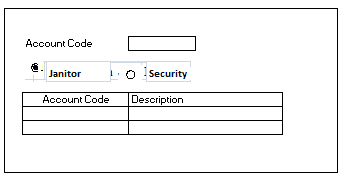|||||||||||
| :- | :- | :- | :- | :- | :- | :- | :- | :- | :- | :- |
||||||||||||
Identify the Janitor/Security Account Code

**4.2   Electricity /Water Account Mapping**

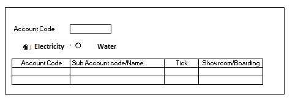

- Account Code- Select Electricity or Water main account (without cost center)
- **Grid** 
- Account code- Display account code with cost center
- ‘Tick’  - All the sub accounts related to main account not take to MIS Report. Only identified sub accounts need to allocate
- ‘Showroom/Boarding’ –To identify sub accounts for two separate reports 

1. **Monthly Janitors  Allocation Entry( New Transaction)**

   ![ref1]

   1. Provide Excel Transfer 
   1. Actual ‘OT/Late’   -If ‘Late ‘  , ‘Hrs ‘ column enter as minus(-)
   1. All the ‘Rate’ column should be decimal 2. 

      Eg :   1,626.35

   1. After Transfer Excel to system, if any data entry amendment, user has to delete transferred reference and need to re transfer excel.
   1. ‘Remark’ – Enter meaningful remarks. If User need to ‘delete’  records ,Help –search display remark

      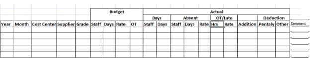

1. Excel Validation – Data Transfer should be Monthly. ‘Year’ column and ‘Month’ column should be same

   Eg:    Year   Month

   `         `----       --------

   `          `2024     05

   `          `2024    05

1. ` `**Monthly Janitory Report**

![ref2]

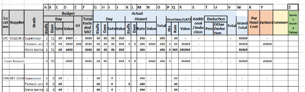

Calculation

1. Budget –Staff  (A)		    Excel Data
1. `                `Days ( B) 		    Excel Data
1. `                 `Rate (C) 		    Excel Data
1. `               `Value(D)  		    A \* B\*C
1. `                 `OT    (E) 		     Excel Data 
1. Total Excluded (F) 		     D+F
1. Actual  Day	 Staff (G) 	     Excel Data
1. `                       `Days (H) 	     Excel Data
1. `                      `Rate (I)     	     Excel ‘C’ column (Budget Rate)
1. `                     `Value(J)    	     G \*H\* I
1. ` `Actual  Absent    Staff (K)  	     Excel  Data
1. `                       `Days (L) 	     Excel  Data 
1. `                       `Rate (M)	     Excel Data
1. `                       `Value(N)   	     K\*L\*M
1. Total (O)    			      J-N    (Day Value- Absent Value)
1. Overtime/Late    Hrs (P) 	     Excel Data
1. `                   `Rate (Q) 		Excel Data
1. `                   `Value (R)  	   P \*Q
1. `   `Additional (S)		 Excel Data
1. `  `Deduction   Penalty (T)	 Excel Data
1. `                       `Other (U)	 Excel Data
1. `   `Total (V) 			 T+U
1. Grand Total (W)    		O +R+S-V
1. Per Head Cost  		Grand Total/ Total Actual Day Staff  

   `                          		 `Sum(Grand\_Total(W))/ Sum(Actual\_Day\_staff(G))

   This should be display only Summary of Cost center +Supplier

1. Variance (Y) 		W- F      Grand Total (W)- Total Budget(F)
1. Service Invoice (Z)    	 Service Invoice Value-Debit Note 

(Year+Month+Cost Center+Janitory Account)  

1. **Monthly Security  Allocation Entry( New Transaction)**

![ref1]

1. Provide Excel Transfer 
1. All the ‘Rate’ column should be decimal 2. 

   Eg :   1,626.35

1. After Transfer Excel to system, if any data entry amendment, user has to delete transferred reference and need to re transfer excel.
1. ‘Remark’ – Enter meaningful remarks. If User need to ‘delete’  records ,Help –search display remark
1. Excel Validation – Data Transfer should be Monthly. ‘Year’ column and ‘Month’ column should be same

   Eg:    Year   Month

   `         `----       --------

   `          `2024     05

   `          `2024    05

 

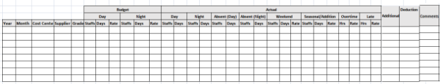

1. **Monthly Security Report**

   ![ref2]

   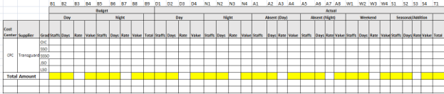

   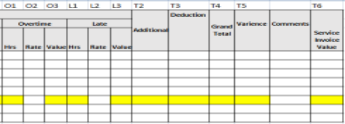

Calculation

1. Budget  	   Day–Staff  (B1)	    Excel Data
1. `                           `Days ( B2)		    Excel Data
1. `                           `Rate (B3)  		    Excel Data
1. `                          `Value(B4) 		   B1 \* B2\*B3
1. `                `Night -Staff   (B5)    	   Excel Data 
1. `                           `Days ( B6)		   Excel Data
1. `                           `Rate (B7)   		   Excel Data
1. `                          `Value(B8) 	    	B5 \* B6\*B7
1. `                         `Total (B9)        		 B4+B8
1. Actual       Day    -Staff (D1)	  	 Excel Data
1. `                              `Days ( D2)	 	 Excel Data
1. `                              `Rate (D3)    	 B3
1. `                               `Value(D4)		 D1 \* D2\*D3
1. `                    `Night   -Staff (N1)   	 Excel Data
1. `                                 `Days ( N2)	  Excel Data
1. `                                 `Rate (N3)		 B7
1. `                                 `Value(N4)  	 N1 \* N2\*N3
1. `               `Absent  Day   -Staff (A1)	 Excel Data
1. `                                 `Days ( A2)     	  Excel Data
1. `                                 `Rate (A3)      	  B3
1. `                                  `Value(A4)      	  A1 \* A2\*A3
1. `              `Absent  Night   -Staff (A5)	  Excel Data
1. `                                   `Days ( A6)	  Excel Data
1. `                                   `Rate (A7)	   B7
1. `                                   `Value(A8)  	   A5 \* A6\*A7
1. `               `Weekend -Staff (W1)	   Excel Data
1. `                                   `Days ( W2)	   Excel Data
1. `                                   `Rate (W3)	   Excel Data
1. `                                   `Value(W4)  	   W1 \* W2\*W3
1. `                   `Seasonal --Staff (S1)	    Excel Data
1. `                                    `Days ( S2)	   Excel Data
1. `                                     `Rate (S3)	    Excel Data
1. `                                     `Value(S4)  	   S1 \* S2\*S3
1. `                     `Total  (T1)   	                  D4+N4-A4-A8+W4+S4
1. `                     `Overtime -Hrs (O1)	    Excel Data
1. `                                      `Rate (O2)	    Excel Data
1. `                                     `Value(O3)  	   O1 \* O2
1. `                       `Late -Hrs (L1)		    Excel Data
1. `                                   `Rate (L2)	    Excel Data
1. `                                   `Value(L3)  	   L1 \* L2
1. `      		 `Additional  (T2)		   Excel Data
1. `      		`Deduction  (T3)		  Excel Data
1. `    		`Grand Total (T4)	  T1+O3-L3+T2-T3
1. `    		`Variance  (T5)    		   B9-T4
1. Service Invoice (T6)    		  Service Invoice Value-Debit Note 

   (Year+Month+Cost Center+Security Account)  

1. ` `**Electricity Unit Transfer Entry (New Transaction**)

   ![ref1]

   1. Provide Excel Transfer 
   1. After Transfer Excel to system, if any data entry amendment, user has to delete transferred reference and need to re transfer excel.
   1. ‘Remark’ – Enter meaningful remarks. If User need to ‘delete’  records ,Help –search display remark
   1. Excel Validation
- Data Transfer should be Monthly
- (Year+Month+ CostCenter+Subaccount)  cannot be duplicate
- If ‘Carder’ is exists ‘Peak’,’Day’,’Off\_Peak’ should be empty
- If ‘Carder’ is exists ‘Common Unit’ should NOT  be empty

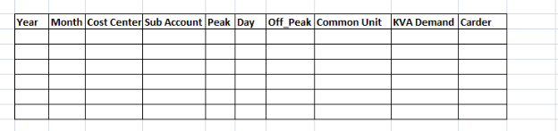

All the Sub accounts related to Electricity account not be captured to MIS Report.

Need to identify ‘**MIS\_Electricity\_Showroom’** related Sub accounts and ‘**MIS\_Electricity** \_**Boarding**’ related  sub accounts

1. **Electricity Comparison Report-Showroom**

   ![ref3]

   **Option : Showroom**

   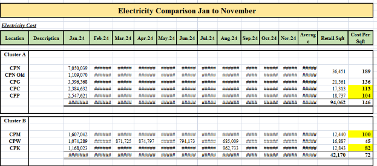

   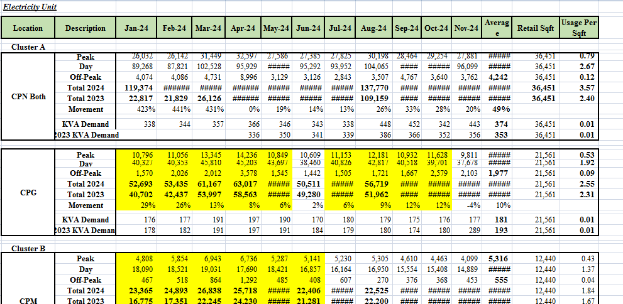

   This report has to filter for subaccount which mention as ’ **MIS\_Electricity\_Showroom’**

   **Calculation –**

   **Electricity Cost**

   **--------------------**

- Monthly Column (Jan\_24, Feb\_24…..\_          - Year+Month+CostCenter    (sum of  Service Invoice Value   ) where subaccount which mention as ’ **MIS\_Electricity\_Showroom’**
- Average         - (Total Monthly Cost values)/no\_of \_months
- Retail square Feet –   Cost center master file Square feet
- Cost  Per Sq Feet-    Average/Retail Square feet

**Electricity Unit**

**-------------------**

- Total\_2024    - Peak+Day+OffPeak
- Total\_2023    -Last Year (Peak+Day+OffPeak)
- Movement  - (Total \_2024-Total\_ 2023)/Total\_2023
- Average         - (Total Units of the Month)/no\_of \_months
- Retail square Feet –   Cost center master file Square feet
- Usage Per Sq Feet-    Average/Retail Square feet

**Option –Boarding**

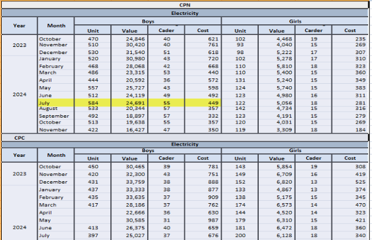

Sub Account Wise column need to Generate (Eg: Boarding Boys, Boarding Girls….)

Unit           - Common Unit (Excel  Transfer)

Value        - Service Invoice

Carder       - Carder (Excel  Transfer)

Cost            -Value/Carder

1. **Water Unit Transfer Entry**

   ![ref1]

   1. Provide Excel Transfer 
   1. After Transfer Excel to system, if any data entry amendment, user has to delete transferred reference and need to re transfer excel.
   1. ‘Remark’ – Enter meaningful remarks. If User need to ‘delete’  records ,Help –search display remark
   1. Excel Validation
- Data Transfer should be Monthly
- (Year+Month+ CostCenter+Subaccount)  cannot be duplicate

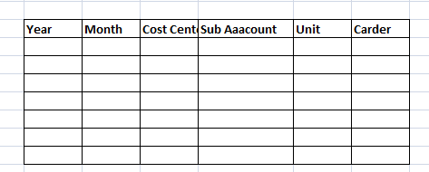

All the Sub accounts related to Water account not be captured to MIS Report.

Need to identify ‘**MIS\_Water\_Showroom’** related Sub accounts and ‘**MIS\_Water**\_**Boarding**’ related  sub accounts

1. **Water  Comparison Report-Showroom**

   ![ref3]

   **Option : Showroom**

   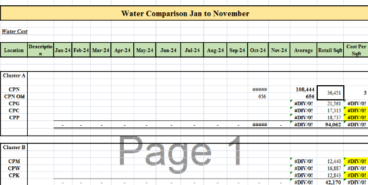

- Monthly Column (Jan\_24, Feb\_24…..\_          - Year+Month+CostCenter    (sum of  Service Invoice Value   ) where subaccount which mention as ’ **MIS\_Water\_Showroom’**
- Average         - (Total Monthly Cost values)/no\_of \_months
- Retail square Feet –   Cost center master file Square feet
- Cost  Per Sq Feet-    Average/Retail Square feet

**Option : Boarding**

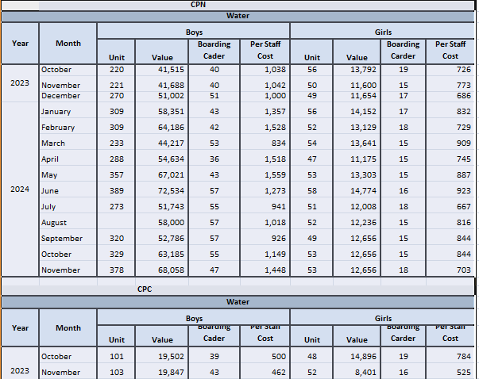

Sub Account Wise column need to Generate (Eg: Boarding Boys, Boarding Girls….)

Unit           - Unit (Excel  Transfer)

Value        - Service Invoice

Carder       - Carder (Excel  Transfer)

Cost            -Value/Carder

[ref1]: Aspose.Words.66b6a8bd-3408-4716-bab9-a3c1c23856cd.006.png
[ref2]: Aspose.Words.66b6a8bd-3408-4716-bab9-a3c1c23856cd.008.png
[ref3]: Aspose.Words.66b6a8bd-3408-4716-bab9-a3c1c23856cd.014.png
